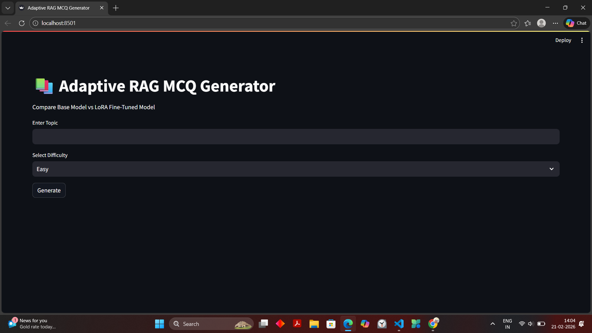

# 🧠 Adaptive LoRA Fine-Tuned MCQ Generator



A Streamlit-based NLP application that compares a base sequence-to-sequence model with a LoRA fine-tuned variant for automatic MCQ generation.

The system evaluates model outputs using BLEU, ROUGE-L, and BERTScore metrics and benchmarks inference time.

---

## 🚀 Features

- 🤖 Base Model: google/flan-t5-base
- 🎯 LoRA Fine-Tuning using PEFT
- 📊 Automatic Evaluation (BLEU, ROUGE-L, BERTScore)
- ⚡ Inference Time Comparison
- 🌐 Interactive Streamlit Web Interface

---

## 🏗️ Project Structure
# 🧠 Adaptive LoRA Fine-Tuned MCQ Generator


A Streamlit-based NLP application that compares a base sequence-to-sequence model with a LoRA fine-tuned variant for automatic MCQ generation.

The system evaluates model outputs using BLEU, ROUGE-L, and BERTScore metrics and benchmarks inference time.

---

## 🚀 Features

- 🤖 Base Model: google/flan-t5-base
- 🎯 LoRA Fine-Tuning using PEFT
- 📊 Automatic Evaluation (BLEU, ROUGE-L, BERTScore)
- ⚡ Inference Time Comparison
- 🌐 Interactive Streamlit Web Interface

---

## 🏗️ Project Structure
mcq-rag-app/
│
├── app.py
├── requirements.txt
├── mcq_lora_model/
├── assets/
│ └── app_demo.png
└── README.md

---

## 🧠 Model Details

- Base Model: google/flan-t5-base
- Fine-Tuning: LoRA (Low-Rank Adaptation)
- Frameworks: Transformers, PEFT, PyTorch

---

## 📊 Evaluation Metrics

- BLEU
- ROUGE-L
- BERTScore

---

## 🖥️ Run Locally

```bash
git clone https://github.com/swati-mishra07/mcq-rag-app.git
cd mcq-rag-app

python -m venv venv
venv\Scripts\activate

pip install -r requirements.txt
streamlit run app.py

---

📈 Applications
EdTech platforms
Automated test generation
AI curriculum tools

---
👩‍💻 Author
Swati Mishra
GitHub: https://github.com/swati-mishra07